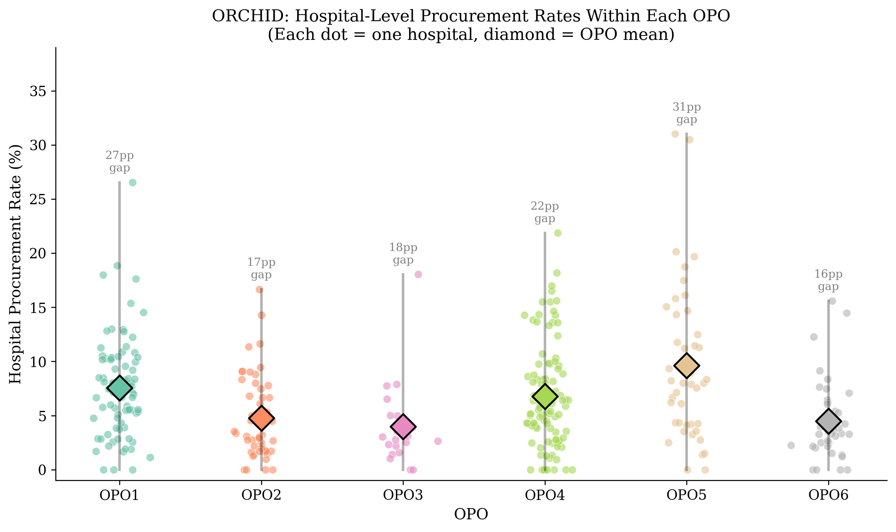
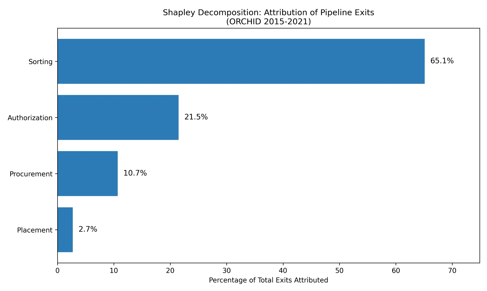
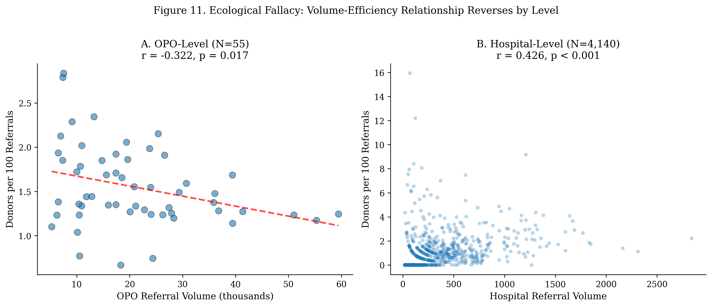

# Hospital-OPO Interface Variance

> **Pre-Publication Research**  
> This repository contains a pre-publication manuscript and supporting analysis code. The work has not yet undergone formal peer review. See [docs/NOTICE.md](docs/NOTICE.md) for details.

**The Coordination Constraint: Hospital-Level Variance as the Primary Determinant of Organ Procurement Performance**

## Overview

This repository contains the analysis code, data outputs, and manuscript for a study investigating the sources of performance variation in the US deceased organ procurement system. The central finding is that the hospital-OPO interface, not the OPO itself, is the primary locus of performance heterogeneity.

## Core Thesis

The dominant narrative in organ procurement policy focuses on differences *between* Organ Procurement Organizations (OPOs). This research challenges that framing. Using both historical, granular process data (ORCHID, 2015-2021) and contemporary, national outcome data (OSR, 2024), we demonstrate that the majority of performance heterogeneity occurs *within* a single OPO's service area, at the interface between the OPO and its individual partner hospitals.

This finding reframes the problem of organ procurement efficiency. It is not primarily a story of "good OPOs" versus "bad OPOs," but of well-coordinated and poorly-coordinated hospital-OPO dyads. The implication is that the most promising levers for improvement lie in strengthening the coordination infrastructure at the local, hospital-OPO level.

## Key Findings

| Finding | ORCHID (2015-2021) | OSR 2024 (National) |
|:--------|:-------------------|:--------------------|
| **Within-OPO Variance** | 82.6% | 93.1% |
| **Between-OPO Variance** | 17.4% | 6.9% |
| **ICC** | 0.174 | 0.069 |
| **Zero-Donor Hospitals** | N/A | 2,136 of 4,140 (51.6%) |

### Additional Findings

1. **Case-Mix Adjusted Variation:** Even for clinically homogeneous, high-quality cases (Head Trauma, ages 18-50), approach rates varied by 29-50 percentage points across hospitals within the same OPO, demonstrating that similar cases receive systematically different treatment depending on hospital location.

2. **Shapley Decomposition (Contextualizing the Funnel):** 86.6% of referrals that do not become donors exit at the Sorting (65.1%) and Authorization (21.5%) stages. While high exit rates at these early stages are expected in a well-functioning triage system, the lack of established clinical protocols or workforce standardization at these stages creates the opportunity for the discretionary variation observed in our case-mix analysis. This suggests the margin for improvement may lie in how hospitals and OPOs coordinate to identify and triage potential donors.

3. **Ecological Fallacy in Volume-Efficiency:** At the OPO level, referral volume and donor rates are negatively correlated (r=-0.322), suggesting diseconomies of scale. However, at the hospital level, the correlation is positive (r=+0.426). This paradox is explained by portfolio composition: larger OPOs serve more hospitals, including more zero-donor facilities.

4. **Potential Gains:** If all hospitals achieved their OPO's 75th percentile performance, an additional 4,135 donors (+24.5%) could be recovered annually.

5. **Zero-Donor Hospitals:** 2,136 of 4,140 hospitals (51.6%) with ≥20 referrals produced zero donors in 2024, present in all 55 OPOs.

## Key Visualizations

### Within-OPO Hospital Variation

*Each dot represents one hospital; diamonds indicate OPO means. Within-OPO gaps range from 16 to 31 percentage points.*

### Shapley Decomposition: Where Referrals Exit

*86.6% of referrals that do not become donors exit at the Sorting and Authorization stages—the stages lacking national protocols or workforce standardization.*

### The Ecological Fallacy

*The volume-efficiency relationship reverses by level: negative at OPO level (r=-0.322), positive at hospital level (r=+0.426).*

## Repository Structure

```
hospital-opo-interface-variance/
│
├── README.md                         # This file
├── LICENSE                           # MIT License
│
├── manuscript/                       # Manuscript files
│   ├── full_manuscript.md            # Complete publication-ready manuscript
│   └── manuscript.tex                # LaTeX version for journal submission
│
├── code/                             # Analysis code
│   ├── main/                         # Core analysis scripts
│   │   ├── coordination_analysis.py      # Primary ORCHID analysis
│   │   ├── hospital_variance_analysis.py # Hospital-level variance
│   │   ├── osr_2024_variance_analysis.py # 2024 national validation
│   │   ├── icc_standardization_analysis.py
│   │   ├── create_icc_figure.py
│   │   └── reality_check.py
│   │
│   └── supplementary/                # Extended analysis scripts (01-14)
│       ├── 01_main_analysis.py
│       ├── 02_variance_figures.py
│       ├── 03_potential_gains_analysis.py
│       ├── 04_robustness_checks.py
│       ├── 05_data_validation.py
│       ├── 06_methodology_alignment.py
│       ├── 07_icc_sensitivity.py
│       ├── 08_case_mix_variation.py
│       ├── 09_shapley_decomposition.py
│       ├── 10_representativeness_analysis.py
│       ├── 11_demographic_comparison.py
│       ├── 12_system_evolution.py
│       ├── 13_zero_donor_analysis.py
│       └── 14_deidentification_validation.py
│
├── data/                             # Data files
│   ├── raw/                          # Raw input data
│   │   └── OSR_final_tables2505.xlsx     # 2024 OSR source data (public)
│   │
│   └── results/                      # Analysis outputs
│       ├── coordination_analysis_results.txt
│       ├── hospital_variance_results.txt
│       ├── icc_sensitivity_results.csv
│       ├── potential_gains_results.csv
│       ├── shapley_results.csv
│       ├── representativeness_structural.csv
│       ├── representativeness_magnitude.csv
│       ├── demographic_representativeness.csv
│       └── zero_conversion_by_opo.csv
│
├── figures/                          # Publication figures
│   ├── Figure1_ICC_Comparison.png
│   ├── Figure2_Shapley_Decomposition.png
│   ├── Figure3_Ecological_Fallacy.png
│   ├── Figure4_Within_OPO_Correlations.png
│   └── FigureS1-S4 (supplementary figures)
│
├── references/                       # Bibliography and primary sources
│   ├── BIBLIOGRAPHY.md
│   ├── optn-management-and-membership-policies.pdf
│   ├── CMS_Final_Rule_2020.pdf
│   ├── OPTN_DDPS_2015.pdf
│   └── OPTN_Response_2020.pdf
│
└── docs/                             # Documentation
    ├── REPRODUCIBILITY.md
    └── NOTICE.md
```

## Data Sources

### ORCHID Dataset (2015-2021)

- **Source:** PhysioNet (https://physionet.org/content/orchid/)
- **Coverage:** 6 OPOs, 343 hospitals, 133,101 referrals
- **Access:** Requires credentialed access and data use agreement
- **Note:** Not included in repository; see [docs/REPRODUCIBILITY.md](docs/REPRODUCIBILITY.md) for access instructions

### OSR 2024 National Data

- **Source:** SRTR OPO-Specific Reports (https://www.srtr.org/reports/opo-specific-reports/)
- **Coverage:** 55 OPOs, 4,140 hospitals with ≥20 referrals, 1.15 million referrals
- **Access:** Publicly available (included in repository)

## Methodology

1. **Variance Decomposition:** Intraclass Correlation Coefficient (ICC) analysis to partition variance into within-OPO and between-OPO components using standardized procurement/donor rates

2. **Shapley Decomposition:** Quantifies where referrals exit the procurement process (Sorting, Authorization, Procurement, Placement)

3. **Case-Mix Adjusted Variation:** Analysis of approach rates for clinically homogeneous subgroups (Head Trauma 18-50, Anoxia 18-40, DBD) to test whether within-OPO variation reflects appropriate clinical heterogeneity

4. **Volume-Efficiency Analysis:** Multilevel correlation analysis to identify and resolve the ecological fallacy

5. **Potential Gains Simulation:** Counterfactual analysis of improvement potential if all hospitals achieved 75th percentile performance

6. **Representativeness Analysis:** Formal assessment distinguishing structural representativeness (do organizational patterns replicate?) from magnitude representativeness (do absolute values match?) to validate generalizability of ORCHID findings to national data

## Reproducibility

See [docs/REPRODUCIBILITY.md](docs/REPRODUCIBILITY.md) for complete instructions on reproducing all analyses.

### Quick Start

```bash
# Clone repository
git clone https://github.com/2460bazinga/hospital-opo-interface-variance.git
cd hospital-opo-interface-variance

# Install dependencies
pip install numpy pandas scipy statsmodels openpyxl matplotlib seaborn

# Run 2024 validation (uses included public data)
python code/main/osr_2024_variance_analysis.py

# Run primary analysis (requires ORCHID data access)
python code/main/coordination_analysis.py
```

## Intellectual Framing

This research proceeds from the recognition that organ procurement constitutes a complex, multi-stakeholder coordination problem. The loss of potential donors stems not primarily from the deliberate choices of any single actor, but from coordination constraints at the sorting phase: the critical juncture where referrals are triaged for pursuit or dismissal. These constraints arise from fragmented infrastructure, constrained capacity, uneven expertise, limited visibility into real-time case dynamics, and the absence of systematic performance feedback. The result: recoverable opportunities dissipate across organizational boundaries before they can be captured.

## Author

**Noah Parrish**

## Citation

If you use this work, please cite:

> Parrish, N. (2026). The Coordination Constraint: Hospital-Level Variance as the Primary Determinant of Organ Procurement Performance. *Pre-publication manuscript*. Available at: https://github.com/2460bazinga/hospital-opo-interface-variance

## License and Usage

© 2026 Noah Parrish. All rights reserved.

This project is licensed under the MIT License. See [LICENSE](LICENSE) for details.

This work is shared for the purpose of **academic review, collaboration, and public benefit**. While the code and analysis are open source, the manuscript and associated intellectual property should not be shared, reproduced, or used without explicit permission from the author.

For inquiries regarding collaboration, academic review, or permission to use this work, please contact the author directly.

---

*See [docs/NOTICE.md](docs/NOTICE.md) for important information about the pre-publication status of this research.*

---

## AI Disclosure

This research, including data analysis, Python script writing, and manuscript preparation, was conducted with the assistance of large language models and agentic AI tools, including OpenAI GPT-4, Anthropic Claude Opus 4.5, Google Gemini, and Manus 1.6. All AI-assisted output was reviewed and edited by the author, who takes full responsibility for the final content.
