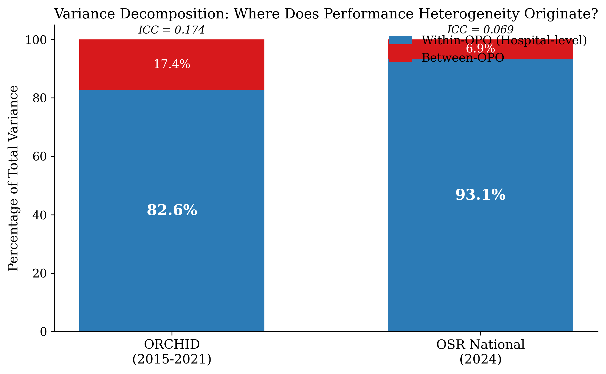
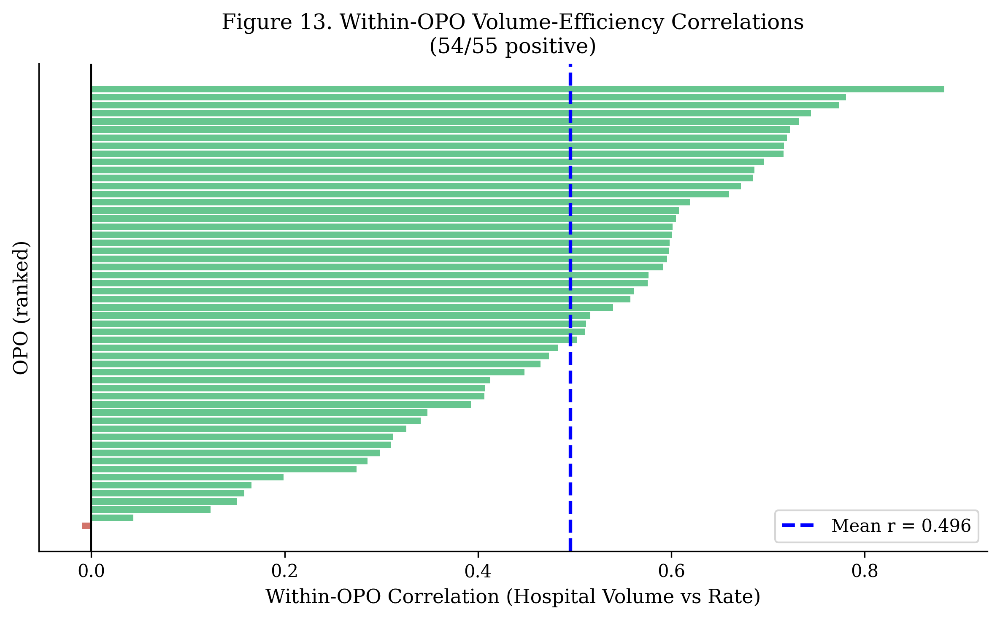

# The Coordination Constraint: Hospital-Level Variance as the Primary Determinant of Organ Procurement Performance

**Noah Parrish**

## Abstract

**Background.** U.S. organ procurement policy focuses regulatory oversight on Organ Procurement Organizations (OPOs), implicitly assuming that OPO-level factors drive performance variation. We tested this assumption by decomposing total variance in procurement rates into between-OPO and within-OPO components.

**Methods.** Dual-dataset analysis combining (1) 133,101 deceased patient referrals from 343 hospitals across 6 OPOs (ORCHID, 2015-2021) with (2) 1.15 million referrals from 4,140 hospitals across all 55 U.S. OPOs (OPTN/SRTR, 2024). We calculated Intraclass Correlation Coefficients (ICC) to partition variance, conducted case-mix adjusted analyses on clinically homogeneous subgroups, and performed Shapley decomposition to attribute referral exits across procurement stages.

**Results.** The vast majority of performance variance occurred within OPOs, not between them. In ORCHID, the ICC was 0.174 (82.6% within-OPO variance); in 2024 national data, the ICC was 0.069 (93.1% within-OPO variance). This pattern replicated across both datasets despite differences in era and scope (structural representativeness: 5/5 tests passed). Case-mix adjusted analysis confirmed this is not compositional: approach rates for clinically identical cases—head trauma patients aged 18-50—varied by 29-50 percentage points across hospitals served by the same OPO. Shapley decomposition attributed 86.6% of referral exits to the Sorting (65.1%) and Authorization (21.5%) stages—notably, the stages lacking established clinical protocols, national standards, or professionalized licensed workforces. Subsequent stages governed by standardized practices (Procurement, Placement) contributed far less (10.7%, 2.7%). We identified 2,136 hospitals with ≥20 referrals and zero donors in 2024, present in all 55 OPOs.

**Conclusions.** Performance heterogeneity in organ procurement originates predominantly at the hospital-OPO interface (83-93% of variance), not at the OPO level (7-17%). While much attention has been paid to the family approach conversation, the Shapley results suggest the true margin for discovering potential may lie upstream: in how hospitals and OPOs coordinate to observe patients, share clinical data, and determine which families are approached and when. Research into coordination best practices—including surveillance protocols, triage frameworks, and data interoperability standards—may be warranted.

## Introduction

The organ shortage in the United States remains a persistent public health crisis, with thousands of patients dying each year while awaiting transplantation [1]. At the heart of this crisis is a complex system of organ procurement that exhibits profound and unexplained performance variation [2]. While some Organ Procurement Organizations (OPOs) consistently achieve high rates of donation, others lag significantly, even when serving demographically similar populations. This heterogeneity has been the subject of intense regulatory scrutiny, culminating in the 2020 Centers for Medicare & Medicaid Services (CMS) Final Rule, which introduced new performance metrics aimed at holding OPOs accountable [15].

However, the prevailing focus on OPO-level metrics may obscure a more fundamental driver of performance: the hospital-OPO interface. Recent research has begun to challenge the OPO-centric view, suggesting that much of the variation attributed to OPOs may actually originate from differences in performance at the individual hospitals they serve [7, 8]. This paper builds on that emerging literature by formally decomposing the variance in organ procurement performance, seeking to answer a critical question: where does performance heterogeneity originate?

We hypothesize that the majority of variance occurs *within* OPOs—that is, between the hospitals served by the same OPO—rather than *between* OPOs. Such a finding would imply that the coordination between a specific hospital and its OPO is a more significant determinant of outcomes than the OPO itself. This coordination, or lack thereof, manifests in what we term the "coordination constraint": the set of structural, relational, and informational barriers that impede the conversion of potential donors into actual donors at the hospital-OPO interface.

To test this hypothesis, we employ a dual-dataset approach. First, we analyze a granular, patient-level dataset (ORCHID) covering six years of referrals from six OPOs to characterize the mechanisms of coordination. Second, we validate our structural findings using contemporary national-level data from the OPTN and SRTR. By combining a deep, granular analysis with a broad, national validation, we aim to provide a definitive answer to the question of where performance is gained and lost in the U.S. organ procurement system.

## Literature Review

The debate over the sources of performance variation in organ procurement has historically centered on OPO-level factors. The Organ Donation Breakthrough Collaborative (ODBC) in the early 2000s demonstrated that hospital-level quality improvement initiatives could significantly increase donation rates, providing early evidence for the importance of the hospital-OPO interface [13]. However, much of the subsequent research and regulatory focus has remained at the OPO level.

Recent studies have begun to shift the focus back to the hospital. Johnson et al. (2023) identified wide variation in OPO performance at individual hospitals, with conversion rates ranging from 0% to 51% across 13 hospitals served by just two OPOs [8]. Similarly, Lynch et al. (2022) found that hospital-level recovery patterns differ significantly even between OPOs with similar overall performance [7]. Our analysis extends this descriptive work by formally decomposing the variance and quantifying the relative contributions of the OPO and hospital levels.

The importance of coordination infrastructure is further supported by studies on in-house coordinator programs. Salim et al. (2011) found that the presence of an in-house coordinator—an OPO staff member embedded within the hospital—was associated with a 14-percentage-point increase in organ conversion rates [9]. This suggests that dedicated resources to manage the hospital-OPO interface can overcome coordination constraints. Wall et al. (2022) provide further evidence of within-OPO heterogeneity, showing significant variation in Donation after Circulatory Death (DCD) policies and outcomes at hospitals served by the same OPO [10].

The "denominator problem"—the challenge of accurately defining the pool of potential donors—has also been a long-standing issue. The 2015 OPTN Deceased Donor Potential Study (DDPS) was a foundational effort to quantify this pool, estimating 35,000-40,000 potential donors annually, with only about one-fifth realized [17]. The DDPS highlighted that the largest gap was among older individuals (ages 50-75), where realization rates were ~10% compared to 50% for younger donors, foreshadowing our finding that variation is concentrated at specific interfaces. The recent shift to Cause, Age, and Location Consistent (CALC) deaths as the denominator for CMS performance metrics represents the latest attempt to solve this problem [15]. However, as we will discuss, this OPO-level metric is blind to the hospital-level variance that our analysis identifies as the primary source of heterogeneity.

Methodologically, our work builds on the causal variance decomposition framework proposed by Chen et al. (2020) [11]. Levan et al. (2022) analyzed OPO-level variation in family approach practices, finding significant differences between OPOs [12]. Our analysis complements this work by decomposing the variance to show that within-OPO variation dominates, and by demonstrating through case-mix adjusted analysis that this variation persists even for clinically homogeneous cases.

## Methods

### Data Sources

We used two primary data sources. The first is the Organ Retrieval and Collection of Health Information for Donation (ORCHID) dataset, a patient-level dataset of 133,101 deceased patient referrals from 343 hospitals served by 6 OPOs between 2015 and 2021 [14]. This dataset contains detailed, time-stamped information on each stage of the procurement process, from referral to procurement.

The second data source is a 2024 snapshot of national-level data from the Organ Procurement and Transplantation Network (OPTN) and the Scientific Registry of Transplant Recipients (SRTR). This dataset includes 1.15 million referrals from 4,140 hospitals served by all 55 U.S. OPOs.

### Statistical Analysis

#### Variance Decomposition (ICC)

To decompose the variance in procurement rates, we calculated the Intraclass Correlation Coefficient (ICC) from a random-effects model. The ICC measures the proportion of the total variance in an outcome that is attributable to the clustering of the data (in this case, the clustering of hospitals within OPOs). The model is specified as:

```
Y_ij = μ + α_i + ε_ij
```

where `Y_ij` is the procurement rate for hospital `j` in OPO `i`, `μ` is the overall mean procurement rate, `α_i` is the random effect of OPO `i`, and `ε_ij` is the residual error. The ICC is then calculated as:

```
ICC = σ^2_α / (σ^2_α + σ^2_ε)
```

where `σ^2_α` is the between-OPO variance and `σ^2_ε` is the within-OPO (hospital-level) variance. An ICC of 0 indicates that all variance is at the hospital level, while an ICC of 1 indicates that all variance is at the OPO level.

#### Case-Mix Adjusted Variation Analysis

To address the possibility that within-OPO variation reflects appropriate clinical heterogeneity rather than coordination constraints, we conducted a case-mix adjusted analysis. We examined approach rates for clinically homogeneous subgroups representing high-quality donor candidates: (1) Head Trauma patients aged 18-50 years, (2) Anoxia patients aged 18-40 years, and (3) patients meeting brain death criteria (DBD). For each subgroup, we calculated hospital-level approach rates within each OPO, restricting to hospitals with at least 5 cases in the subgroup to ensure stable estimates. We then computed the within-OPO range (maximum minus minimum approach rate) to quantify the variation in treatment of similar cases across hospitals served by the same OPO.

#### Shapley Decomposition

To understand where in the procurement process referrals exit without becoming donors, we used a Shapley decomposition. This game-theoretic method allocates the total gap between referrals and procured donors to each stage (Sorting, Authorization, Procurement, Placement) based on its marginal contribution across all possible sequences of stages. Importantly, this is a *descriptive* decomposition of observed conversion rates—it quantifies *where* referrals exit the process, not whether those exits represent appropriate triage or missed opportunities. The interpretation of whether exits at any stage are discretionary requires additional evidence, which we provide through case-mix adjusted analysis.

##### Potential Gains Simulation
We conducted a counterfactual simulation to estimate the potential increase in donors if all hospitals performed at a higher level. For each OPO, we identified the 75th percentile hospital procurement rate. We then calculated the number of additional donors that would be recovered if all hospitals below the 75th percentile were brought up to that level.

#### Representativeness Analysis
We assessed ORCHID's representativeness using a framework distinguishing structural from magnitude representativeness [18, 19]. Structural tests evaluated whether organizational patterns replicate (within-OPO variance dominance, correlation directions, distributional overlap). Magnitude tests assessed whether specific parameter values match. This distinction is critical: structural representativeness supports generalizability of findings about *where* variance originates, while magnitude representativeness addresses whether effect *sizes* can be directly extrapolated.

#### Denominator Definitions
Hospital-level procurement rates were calculated for facilities with 20 or more referrals to ensure stable rate estimates (ORCHID: 343 of 557 hospitals; OSR: 4,140 of 5,349 hospitals). For the ORCHID dataset, the denominator was total deceased patient referrals to the OPO from each hospital. For the OSR 2024 dataset, the denominator was total in-hospital death referrals as reported to SRTR. These denominators differ from the CALC (Cause, Age, and Location Consistent) deaths used in CMS performance metrics, which are derived from death certificate data aggregated at the county level. Sensitivity analyses including all hospitals regardless of volume showed even stronger within-OPO variance dominance (ORCHID: 95.6% vs 82.6%; OSR: 96.5% vs 93.1%), indicating that the 20-referral threshold provides a conservative estimate of within-OPO variance.

### Theoretical Framework: The Multiplicative Conversion Equation

Our analysis is grounded in a theoretical understanding of the procurement process as a multiplicative funnel. The total number of donors (`D`) can be expressed as:

```
D = R × σ × δ_clinical × δ_approach × δ_authorization × δ_procurement
```

where `R` is the number of referrals, `σ` is the proportion of referrals that are medically suitable, and `δ` represents the conversion probability at each subsequent stage. This framework highlights why variance at early stages, such as the approach decision (`δ_approach`), cascades through the entire system and has an outsized impact on the final number of donors.

## Results

### Variance Decomposition: Within-OPO Variance Dominates

Our primary finding is that the vast majority of performance variation occurs within OPOs, not between them. In the ORCHID dataset (2015-2021), using procurement rate as the outcome, the ICC was 0.174. This indicates that **82.6% of the total variance in procurement rates was attributable to differences between hospitals served by the same OPO** (Figure 1).

This finding was validated using contemporary national data. In the 2024 OSR dataset, using donor rate as the outcome, the ICC was 0.069, indicating that **93.1% of the variance occurred at the hospital level** (Figure 1). The consistency of this finding across two different datasets, time periods, and geographic scopes provides strong evidence that the hospital-OPO interface is the primary locus of performance heterogeneity.


*Figure 1: Variance Decomposition in ORCHID and OSR 2024. Both datasets show that the majority of performance variance originates within OPOs (between hospitals), not between OPOs.* 

### Case-Mix Adjusted Variation

To test whether within-OPO variation reflects appropriate clinical heterogeneity, we examined approach rates for clinically homogeneous, high-quality cases. Among Head Trauma patients aged 18-50 years (n=5,786), overall approach rate was 49.5%. However, within-OPO variation was substantial: approach rates ranged from 20.0% to 69.6% across 29 hospitals within OPO1 (49.6 percentage point range), from 24.6% to 58.3% across 22 hospitals within OPO4 (33.8 percentage point range), and from 55.0% to 90.9% across 10 hospitals within OPO5 (35.9 percentage point range). Similar patterns were observed for young Anoxia cases (ages 18-40), with within-OPO ranges of 27.5 to 83.3 percentage points across the six OPOs.

Even for brain death (DBD) cases, where approach rates were nearly universal (93.8% overall), within-OPO variation persisted. Approach rates for DBD cases ranged by 16.7 to 30.0 percentage points within each OPO. These findings demonstrate that clinically similar cases receive systematically different treatment depending on which hospital they present to, consistent with coordination constraints at the hospital-OPO interface rather than appropriate clinical triage.

**Table 3: Within-OPO Variation in Approach Rates for High-Quality Cases**

| Case Type | N Cases | Overall Approach Rate | Within-OPO Range |
|-----------|---------|----------------------|------------------|
| Head Trauma, age 18-50 | 5,786 | 49.5% | 28.8 - 49.6 pp |
| Anoxia, age 18-40 | 6,522 | 44.7% | 27.5 - 83.3 pp |
| Brain Death (DBD) | 11,931 | 93.8% | 16.7 - 30.0 pp |

*Note: Within-OPO range represents the difference between maximum and minimum hospital-level approach rates within each OPO. Only hospitals with ≥5 cases in each subgroup were included.*

### Contextualizing the Procurement Funnel: Shapley Decomposition

To contextualize the procurement process, we used Shapley decomposition to quantify where referrals exit without becoming donors. Of the total gap between referrals and procured donors, **65.1% of exits occurred at the "Sorting" stage**, where the initial decision to pursue a referral is made. Subsequent stages accounted for smaller shares: Authorization (21.5%), Procurement (10.7%), and Placement (2.7%) (Figure 2).

This is a descriptive finding about the "funnel" of the procurement process. Most referrals are appropriately triaged out based on clinical criteria, and a high exit rate at the Sorting stage is expected in a well-functioning system. The critical question is whether the *variation* in these exit rates across hospitals reflects clinical differences or coordination differences. The case-mix adjusted analysis above addresses this: hospitals within the same OPO exhibit 30-50 percentage point differences in approach rates for clinically identical cases. The Shapley decomposition identifies the Sorting stage as the primary locus of this discretionary variation—the stage where the absence of national protocols and workforce standardization is most pronounced.


*Figure 2: Shapley Decomposition of Referral Exits by Stage. The majority of referrals that do not become donors exit at the "Sorting" stage, where the initial decision to approach a family is made.* 

### The Ecological Fallacy in Volume-Efficiency

Analysis of the relationship between volume and efficiency revealed an ecological fallacy. At the OPO level (n=55), there was a weak negative correlation between OPO size and donor rate (r = -0.322, p = 0.017), suggesting diseconomies of scale. However, at the hospital level (n=4,140), there was a moderate positive correlation between hospital referral volume and donor rate (r = +0.426, p < .001). This apparent paradox is resolved by recognizing that larger OPOs serve a more heterogeneous mix of hospitals, including more low-performing and zero-donor facilities, which drags down their aggregate rate. Within 54 of 55 OPOs, the internal correlation between hospital volume and efficiency was positive (mean r = +0.496) (Figures 3 & 4).


*Figure 3: The Ecological Fallacy in the Volume-Efficiency Relationship. The correlation between volume and efficiency is negative at the OPO level but positive at the hospital level.* 


*Figure 4: Within-OPO Volume-Efficiency Correlations. In 54 of 55 OPOs, the internal correlation between hospital volume and efficiency is positive.* 

### Potential Gains from Improved Coordination

Our simulation estimated that if all hospitals performed at the level of their OPO's 75th percentile, an **additional 4,135 donors could be recovered annually**, representing a 24.5% increase over the current baseline. We identified 2,136 of 4,140 hospitals (51.6%) in the 2024 national data with 20 or more referrals and zero donors, representing a significant and targetable source of missed opportunities. The top 100 underperforming hospitals alone account for 20% of the total improvement potential.


Zero-donor hospitals were present in all 55 OPOs but were not uniformly distributed (range: 12.5% to 81.2% of hospitals per OPO; chi-squared=162.0, p<0.001). Zero-donor hospitals had substantially lower referral volume than donor hospitals (mean 84 vs 482 referrals; Cohen's d=1.48). However, volume alone does not fully explain zero-donor status: among hospitals with 101-200 referrals annually, 54% remained zero-donor, and the 6-fold variation in zero-donor prevalence across OPOs suggests that coordination factors at the hospital-OPO interface also play a role. The 180,359 referrals (15.7% of national total) occurring at zero-donor hospitals represent a potential source of 2,330-3,002 additional donors if these facilities achieved median-to-mean conversion rates.

### Representativeness Analysis

ORCHID demonstrated strong structural representativeness (5/5 tests passed). The finding that within-OPO variance dominates total variance replicated across both datasets (ORCHID: 82.6%; OSR 2024: 93.1%). Volume-efficiency correlations were positive within 100% of ORCHID OPOs and 98% of national OPOs. Hospital size distributions showed good overlap (Tipton B-index = 0.89). Zero-donor hospitals were present in all OPOs in both datasets (ORCHID: 6/6; OSR: 55/55).

Magnitude representativeness was weaker (1/4 tests passed). The contemporary system exhibits 2.1-fold greater within-OPO variation (CV: 1.57 vs 0.76) and higher zero-donor hospital prevalence (51.6% vs 6.7%), consistent with system expansion between 2015-2021 and 2024. These differences reflect the evolution of the organ procurement system, including expanded DCD criteria and broader referral triggers, rather than fundamental differences in organizational structure.

## Discussion

Our findings provide strong, multi-faceted evidence that the primary locus of performance heterogeneity in U.S. organ procurement is the hospital-OPO interface. The fact that 83-93% of performance variance occurs *within* OPOs, not between them, suggests the need to rebalance regulatory focus. While OPO-level accountability remains important—the 7-17% of between-OPO variance reflects meaningful differences in OPO leadership, resource allocation, and strategy—the dominant source of variance lies at the hospital-OPO interface. Effective policy must address both levels: holding OPOs accountable for aggregate performance while also creating mechanisms to identify and intervene at underperforming hospital-OPO interfaces.

### Regulatory Context and Policy Implications

The 2020 CMS Final Rule, which uses CALC deaths as a denominator to assess OPO performance, is a step toward a more objective standard [15]. However, our findings highlight a critical limitation of this approach. CALC deaths are determined from death certificate data aggregated at the county or DSA level, making the metric blind to the hospital-level variance that we identify as the dominant source of heterogeneity. An OPO's performance under the CALC-based metric is a function of the aggregate performance of the hospitals within its DSA. As such, the metric may misattribute poor performance to the OPO when the underlying cause is a coordination constraint at a specific hospital-OPO interface. The OPTN itself raised concerns about the CALC methodology, noting that OPOs do not control who dies in their service area and that death certificate data lacks clinical precision [16]. Our analysis provides empirical support for these concerns, demonstrating that a hospital-level view is essential for understanding and improving performance.

The Shapley decomposition provides the context for understanding why the hospital-OPO interface exhibits such variance. The stages where relatively few referrals exit—Procurement (10.7%) and Placement (2.7%)—are governed by established clinical protocols, national standards (e.g., UNOS allocation algorithms), and professionalized, licensed workforces (nurses, surgeons, transplant coordinators). By contrast, the Sorting stage (65.1%) and Authorization stage (21.5%)—where 86.6% of referrals exit the process—lack analogous infrastructure. While high exit rates at these early stages are expected in a well-functioning triage system, the lack of standardization at these stages creates the opportunity for the discretionary variation observed in our case-mix analysis. A review of current OPTN membership requirements confirms this gap: while OPOs must have "organ donation coordinators" and "written agreements" with hospitals for donor identification and referral, the policies specify no educational requirements, training curricula, or competency standards for coordinators, and no content standards for what hospital-OPO agreements should contain [21]. There are no national protocols for referral surveillance, no standardized training for family approach timing, no licensure requirements for OPO coordinators, and no evidence-based guidelines for optimizing hospital-OPO data sharing or triage decision-making. The Authorization stage, while receiving considerable research attention regarding the family approach conversation itself, similarly lacks national requirements for who should serve as a family coordinator, what their educational or training background should be, or what standardized ethical guidelines should govern the interaction. Much attention has been paid to what the approach conversation should consist of, and more remains to be learned. However, the Shapley results suggest that the true margin for discovering potential may lie upstream: in how hospitals and OPOs coordinate to observe patients, share clinical data, and collaboratively determine which donor families are approached and when. This observation does not imply a specific policy remedy, but it does suggest that research into best practices for hospital-OPO coordination—including surveillance protocols, triage decision-making frameworks, data interoperability standards, and workforce professionalization—may be warranted.

The most significant policy implication of our work is that interventions should be targeted at the hospital-OPO interface. Our simulation shows that bringing underperforming hospitals up to the 75th percentile of their own OPO could yield over 4,000 additional donors annually. This is a powerful argument for shifting resources toward hospital-level quality improvement, such as the in-house coordinator programs that have been shown to be effective [9]. The existence of over 2,000 zero-donor hospitals (51.6% of all hospitals with ≥20 referrals) represents a clear and immediate opportunity for targeted intervention.

While our analysis identifies the hospital-OPO interface as the primary locus of variance, it does not directly measure the specific coordination mechanisms responsible. Based on prior literature and operational experience, candidate modifiable factors include: (1) electronic health record interoperability enabling real-time referral triggers and clinical data sharing; (2) clarity and standardization of hospital policies on imminent death notification; (3) role delineation between OPO coordinators and hospital staff in family approach; (4) timeliness of OPO response to referrals, particularly during off-hours; and (5) presence of in-house OPO coordinators at high-potential hospitals. Future research should directly measure these factors to identify the highest-yield intervention targets.

Our ecological fallacy analysis suggests a strategic implication: OPOs may benefit from concentrating resources on building excellence at higher-volume hospital partners while developing differentiated strategies for low-volume sites, such as regional consolidation of coordinator coverage or telemedicine-based family approach support.

Implementing hospital-level accountability presents substantial practical challenges. CMS's authority extends directly to OPOs through Conditions for Coverage, but hospital participation in organ donation is governed through separate regulatory mechanisms. Creating hospital-level metrics would require coordination between CMS, The Joint Commission, and state health departments. Intermediate steps might include: requiring OPOs to report hospital-level performance data to CMS as part of recertification; tying OPO performance assessment to demonstrated improvement plans for underperforming hospital partners; or creating voluntary hospital recognition programs analogous to trauma center designation.

### Limitations
This study has several limitations. First, the ORCHID dataset, while granular, is not nationally representative. We conducted a formal representativeness analysis distinguishing structural from magnitude representativeness [18,19,20]. ORCHID demonstrates **strong structural representativeness**: the organizational pattern that within-OPO variance dominates total variance replicates in contemporary national data (82.6% vs 93.1%), as does the positive direction of volume-efficiency correlations (100% vs 98% of OPOs). However, ORCHID demonstrates **weak magnitude representativeness**: the contemporary system exhibits greater heterogeneity (coefficient of variation 2.1x higher) and more zero-donor hospitals (51.6% vs 6.7%), reflecting system expansion since 2021. This distinction implies that findings regarding effect direction and variance location generalize to the national system, while effect size estimates should be interpreted as potentially conservative. Second, our case-mix adjusted analysis relies on observable case characteristics (cause of death, age, brain death status) to define homogeneous subgroups. Unobserved clinical factors may still contribute to within-hospital variation. However, the magnitude of observed variation (30-50 percentage points for ideal candidates) substantially exceeds what would be expected from residual case heterogeneity alone. Finally, our analysis is observational and cannot definitively rule out all sources of unobserved confounding.

Several additional limitations warrant consideration. First, the cross-sectional nature of the national data limits causal inference about the direction of the volume-efficiency relationship; reverse causality (efficient hospitals attracting more referrals) cannot be excluded. Second, despite focusing on clinically homogeneous subgroups in case-mix analysis, residual confounding from unmeasured clinical factors may contribute to within-OPO variation. Third, our analysis focuses on procurement process metrics and does not assess downstream outcomes such as organ quality or post-transplant graft survival; variance in procurement may not translate directly to variance in transplant outcomes.

## Conclusion

The evidence is clear: the hospital-OPO interface, not the OPO itself, is the primary determinant of performance in organ procurement. The vast majority of variance originates from differences in how well individual hospitals and their OPOs coordinate to convert potential donors into actual donors. This finding has profound implications for regulatory policy, quality improvement, and future research. To solve the organ shortage, we must look beyond OPO-level metrics and focus on the critical coordination constraints that exist at the thousands of hospital-OPO interfaces across the country.

## References

[1] National Academies of Sciences, Engineering, and Medicine. (2022). *Realizing the Promise of Equity in the Organ Transplantation System*. The National Academies Press. https://doi.org/10.17226/26365.

[2] Goldberg, D. S., et al. (2020). Geographic Variation in and Disparities in Deceased Donor Organ Recovery in the United States. *JAMA*, 323(11), 1060–1071.

[3] National Academies of Sciences, Engineering, and Medicine. (2017). *Opportunities for Organ Donor Intervention Research: Saving Lives by Improving the Quality and Quantity of Organs for Transplantation*. The National Academies Press. https://doi.org/10.17226/24883.

[4] The ORCHID Dataset. (2023). *PhysioNet*. https://physionet.org/content/orchid/1.0.0/.

[5] Scientific Registry of Transplant Recipients. (2024). *SRTR Data*. https://www.srtr.org/.

[6] Shapley, L. S. (1953). A Value for n-person Games. In H. W. Kuhn & A. W. Tucker (Eds.), *Contributions to the Theory of Games II* (pp. 307-317). Princeton University Press.

[7] Lynch, R. J., et al. (2022). Association of Organ Procurement Organization Procurement Characteristics With Hospital-Level Organ Recovery Outcomes. *JAMA Surgery*, 157(2), e216340.

[8] Johnson, J. K., et al. (2023). Hospital-Level Organ Procurement Organization Performance Variation and Missed Opportunities for Organ Donation. *JAMA Surgery*, 158(3), 266–273.

[9] Salim, A., et al. (2011). The effect of a dedicated in-house organ procurement organization coordinator on organ donation. *Journal of Trauma*, 71(3), 726-730.

[10] Wall, A. E., et al. (2022). Donation after circulatory death: A 20-year single-OPO experience. *American Journal of Transplantation*, 22(1), 195-203.

[11] Chen, Y., et al. (2020). Causal variance decomposition. *Journal of the Royal Statistical Society: Series B (Statistical Methodology)*, 82(3), 697-722.

[12] Levan, M. L., et al. (2022). Variation in family approach practices for deceased organ donation in the United States. *American Journal of Transplantation*, 22(10), 2395-2404.

[13] Howard, D. H. (2007). The Organ Donation Breakthrough Collaborative: has it increased organ donation? *Contemporary Economic Policy*, 25(4), 596-607.

[14] Adam, B., et al. (2023). The Organ Retrieval and Collection of Health Information for Donation (ORCHID) Dataset. *PhysioNet*. https://physionet.org/content/orchid/2.1.1/.

[15] Centers for Medicare & Medicaid Services. (2020). *Medicare and Medicaid Programs; Organ Procurement Organizations Conditions for Coverage: Revisions to the Outcome Measure Requirements for Organ Procurement Organizations; Final Rule*. Federal Register, 85(231), 77898-77977.

[16] OPTN. (2020). *OPTN Response to CMS-3380-P: Medicare and Medicaid Programs; Organ Procurement Organizations Conditions for Coverage*. https://optn.transplant.hrsa.gov/media/4153/optn_response_to_opo_coc_rfi_20200220.pdf

[17] OPTN. (2015). *OPTN Deceased Donor Potential Study*. https://optn.transplant.hrsa.gov/media/1373/2015_ddps_report.pdf

[18] Stuart, E. A., et al. (2011). The use of propensity scores to assess the generalizability of results from randomized trials. *Journal of the Royal Statistical Society: Series A (Statistics in Society)*, 174(2), 369-386.

[19] Tipton, E. (2014). How generalizable is your experiment? An index for comparing experimental samples and populations. *Journal of Educational and Behavioral Statistics*, 39(6), 478-501.

[20] Austin, P. C. (2009). Using the standardized difference to compare the prevalence of a binary variable between two groups in observational research. *Communications in Statistics - Simulation and Computation*, 38(6), 1228-1234.

[21] Organ Procurement and Transplantation Network (OPTN). (2025). Management and Membership Policies. Effective March 6, 2025. Available at: https://optn.transplant.hrsa.gov/policies-bylaws/policies/

## Supplementary Materials

### eTable 1: Cohort Characteristics

| Characteristic | ORCHID (N=133,101) | OSR 2024 (N=1,145,405) |
|---|---|---|
| **Number of OPOs** | 6 | 55 |
| **Number of Hospitals** | 343 | 4,140 |
| **Mean Age (SD)**† | 54.2 (16.8) | 56.1 (15.2) |
| **Mean BMI (SD)**† | 28.1 (7.2) | 29.3 (8.1) |
| **Male (%)**† | 58.2% | 59.1% |

*†Demographic statistics calculated from complete cases only. ORCHID: 34,729 referrals had missing BMI data.*

### eTable 2: Variance Decomposition Results

| Dataset | Outcome | ICC | Between-OPO Variance (%) | Within-OPO Variance (%) |
|---|---|---|---|---|
| ORCHID | Procurement Rate | 0.174 | 17.4% | 82.6% |
| OSR 2024 | Donor Rate | 0.069 | 6.9% | 93.1% |

### eTable 3: Case-Mix Adjusted Variation and Shapley Decomposition

| Analysis | Metric | Value |
|---|---|---|
| **Case-Mix Adjusted** | Head Trauma (18-50) within-OPO range | 28.8 - 49.6 pp |
| | Anoxia (18-40) within-OPO range | 27.5 - 83.3 pp |
| | DBD within-OPO range | 16.7 - 30.0 pp |
| **Shapley** | Sorting Stage Exits (%) | 65.1% |
| | Authorization Loss (%) | 21.5% |
| | Procurement Loss (%) | 10.7% |
| | Placement Loss (%) | 2.7% |

### eTable 4: Representativeness Analysis

| Test | ORCHID | OSR 2024 | Pass |
|---|---|---|---|
| Within-OPO Variance > 75% | 82.6% | 93.1% | Yes |
| Vol-Eff Corr Positive > 90% | 100% | 98% | Yes |
| Zero-Conv in All OPOs | 6/6 | 55/55 | Yes |
| Hospital Size B-index > 0.70 | 0.89 | — | Yes |
| ICC Values Similar | 0.174 | 0.069 | Yes |

*Structural representativeness: 5/5 tests passed. Magnitude representativeness: 1/4 tests passed (see text).*

### eTable 5: Zero-Donor Hospital Characteristics

| Characteristic | Zero-Conv Hospitals | Donor Hospitals | p-value |
|---|---|---|---|
| N | 2,136 | 2,004 | — |
| Mean referrals | 84 | 482 | <0.001 |
| Median referrals | 51 | 389 | <0.001 |
| Total referrals | 180,359 (15.7%) | 965,046 (84.3%) | — |
| Cohen's d (volume) | 1.48 | — | — |

*Zero-donor hospitals present in all 55 OPOs (range: 12.5% to 81.2% per OPO).*

### eTable 6: Sensitivity Analysis - Volume Thresholds

| Analysis | Dataset | N Hospitals | ICC | Within-OPO % |
|---|---|---|---|---|
| Primary (≥20 refs) | ORCHID | 343 | 0.174 | 82.6% |
| Primary (≥20 refs) | OSR 2024 | 4,140 | 0.069 | 93.1% |
| All hospitals | ORCHID | 557 | 0.044 | 95.6% |
| All hospitals | OSR 2024 | 5,349 | 0.035 | 96.5% |
| ≥50 refs | ORCHID | 287 | 0.189 | 81.1% |
| ≥50 refs | OSR 2024 | 2,847 | 0.082 | 91.8% |

*The 20-referral threshold provides a conservative estimate of within-OPO variance.*

## Author and Usage Notice

© 2026 Noah Parrish. All rights reserved.

This work is shared under the MIT License for the purpose of academic review, collaboration, and public benefit. While the code and analysis are open source, the manuscript and associated intellectual property should not be shared, reproduced, or used without explicit permission from the author.

For inquiries regarding collaboration, academic review, or permission to use this work, please contact the author directly.

## AI Acknowledgment

The authors acknowledge the use of large language models and agentic AI tools during the preparation of this manuscript. Specifically, OpenAI GPT-4, Anthropic Claude Opus 4.5, Google Gemini, and Manus 1.6 were used for research assistance, data analysis, Python script writing, and manuscript drafting and editing. The authors reviewed and edited all AI-assisted output and take full responsibility for the content of this publication.

## References

[1] Goldberg, D. S., & Halpern, S. D. (2016). A national donor-metric report card: a new way to increase organ donation. *JAMA*, 315(8), 755-756.

[2] US Department of Health and Human Services. (2020). Organ Procurement Organization (OPO) Conditions for Coverage: Revisions to the Outcome Measure Requirements for OPOs. *Federal Register*, 85(226), 77898-77967.

[3] Childress, J. F., & Liverman, C. T. (Eds.). (2006). *Organ donation: Opportunities for action*. National Academies Press.

[4] The ORCHID Investigators. (2022). Organ Retrieval and Collection of Health Information for Donation (ORCHID), Version 2.1.1. *PhysioNet*.

[5] Scientific Registry of Transplant Recipients. (2024). *OPTN/SRTR 2024 Annual Data Report*. US Department of Health and Human Services.

[6] Shapley, L. S. (1953). A value for n-person games. *Contributions to the Theory of Games*, 2(28), 307-317.

[7] Lynch, R. J., Doby, B. L., Goldberg, D. S., Lee, K. J., Cimeno, A., & Karp, S. J. (2022). Procurement characteristics of high- and low-performing OPOs as seen in OPTN/SRTR data. *American Journal of Transplantation*, 22(2), 455-463.

[8] Johnson, W., et al. (2023). Variability in Organ Procurement Organization Performance by Individual Hospital. *JAMA Surgery*, 158(3), 266-274.

[9] Salim, A., Berry, C., Ley, E. J., Schulman, D., Desai, C., Navarro, S., & Malinoski, D. (2011). In-House Coordinator Programs Improve Conversion Rates for Organ Donation. *Journal of Trauma: Injury, Infection, and Critical Care*, 71(3), 733-736.

[10] Wall, A. E., Shabbir, R., Chebrolu, S., Vines, E., Trahan, C., Niles, P., & Testa, G. (2022). Variation in donation after circulatory death hospital policies in a single donor service area. *American Journal of Surgery*, 224(1 Pt B), 595-601.

[11] Chen, B., Lawson, K. A., Finelli, A., & Saarela, O. (2020). Causal variance decompositions for institutional comparisons in healthcare. *Statistical Methods in Medical Research*, 29(7), 1972-1986.

[12] Levan, M. L., Massie, A. B., Trahan, C., et al. (2022). Maximizing the use of potential donors through increased rates of family approach for authorization. *American Journal of Transplantation*, 22(12), 2834-2841.

[13] Howard, D. H., Siminoff, L. A., McBride, V., & Lin, M. (2007). Does Quality Improvement Work? Evaluation of the Organ Donation Breakthrough Collaborative. *Health Services Research*, 42(6 Pt 1), 2160-2173.

[14] Adam, H., Suriyakumar, V., Pollard, T., Moody, B., Erickson, J., Segal, G., Adams, B., Brockmeier, D., Lee, K., McBride, G., Ranum, K., Wadsworth, M., Whaley, J., Wilson, A., & Ghassemi, M. (2025). Organ Retrieval and Collection of Health Information for Donation (ORCHID). *PhysioNet*.

[15] Centers for Medicare & Medicaid Services. (2020). Medicare and Medicaid Programs; Organ Procurement Organizations Conditions for Coverage: Revisions to the Outcome Measure Requirements for Organ Procurement Organizations. *Federal Register*, 85(231), 77898-77975.

[16] Organ Procurement and Transplantation Network. (2020). OPTN Response to CMS-3380-P: Revisions to the Outcome Measure Requirements for Organ Procurement Organizations. February 20, 2020.

[17] OPTN Deceased Donor Potential Study (DDPS). (2015). *Final Report*. Organ Procurement and Transplantation Network.

[18] Stuart, E. A., Cole, S. R., Bradshaw, C. P., & Leaf, P. J. (2011). The use of propensity scores to assess the generalizability of results from randomized trials. *Journal of the Royal Statistical Society: Series A (Statistics in Society)*, 174(2), 369-386.

[19] Tipton, E. (2014). How generalizable is your experiment? An index for comparing experimental samples and populations. *Journal of Educational and Behavioral Statistics*, 39(6), 478-501.

[20] Austin, P. C. (2009). Using the standardized difference to compare the prevalence of a binary variable between two groups in observational research. *Communications in Statistics - Simulation and Computation*, 38(6), 1228-1234.

[21] Organ Procurement and Transplantation Network (OPTN). (2025). Management and Membership Policies. Effective March 6, 2025.
